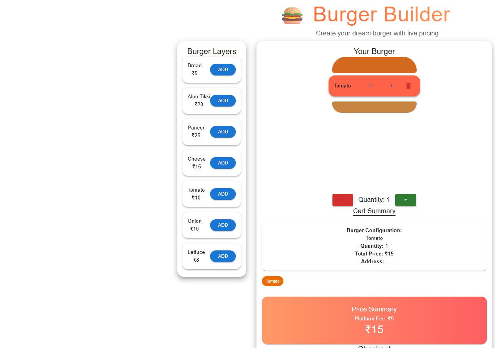
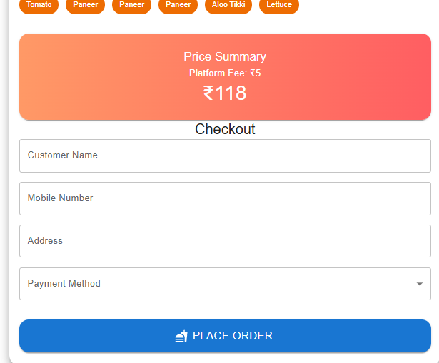
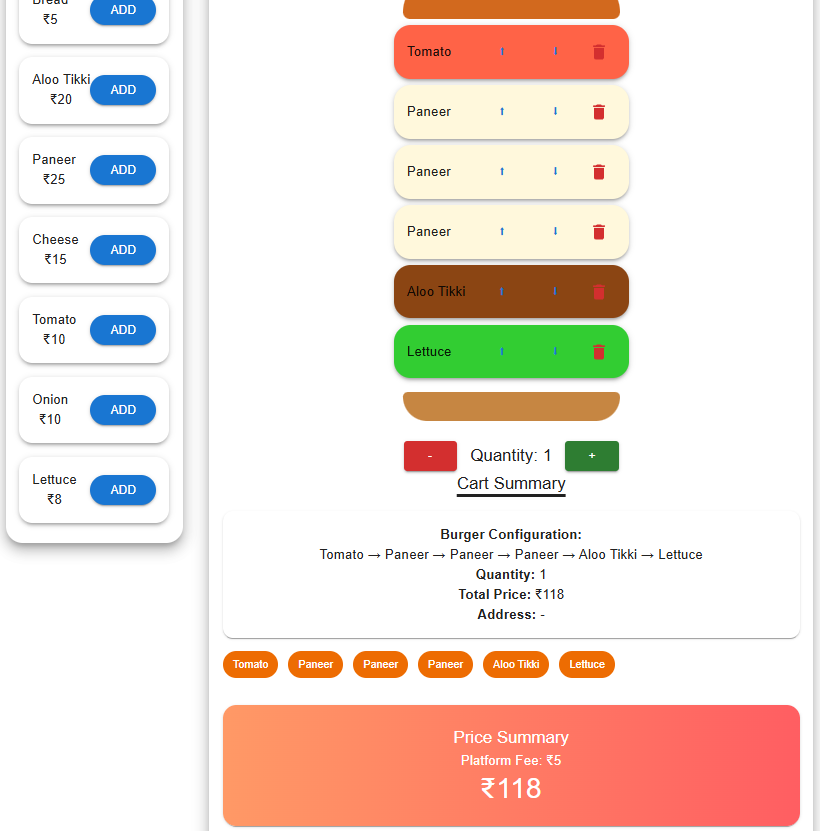

# burger-builder-app
# 🍔 Burger Builder App

A full-stack Burger Builder application built using **React (Client)** and **Node.js + Express (Server)**.

---

## 🚀 Features

- Build custom burgers 🍔
- Add/remove ingredients
- Real-time price calculation
- Order management system
- Responsive UI
- Backend API integration

---

## 🛠️ Tech Stack

### Frontend
- React.js
- Material UI / CSS
- Axios

### Backend
- Node.js
- Express.js
- MongoDB (if used)

---

## 📁 Project Structure

1.burger-app/
├── client/ # React frontend
├── server/ # Node backend

---

## ⚙️ Installation

### 1. Clone repo
```bash
git clone https://github.com/USERNAME/burger-builder-app.git
cd client
npm install
npm start

2.Install frontend
cd client
npm install
npm start

3. Install backend
cd server
npm install
npm start

## Screenshots




